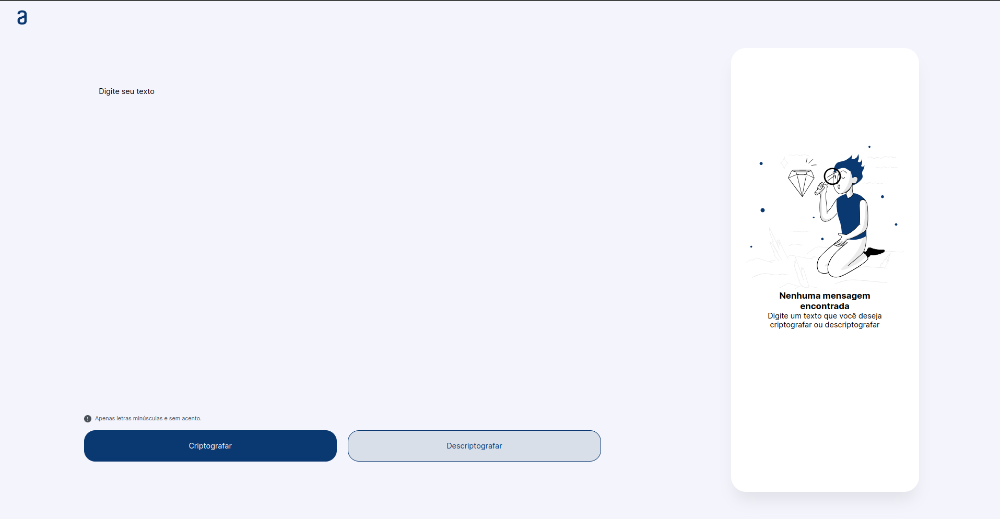

# Desafio One Next Education: Criptografia com CryptoJS e JavaScript

## Sobre o Projeto

Este projeto foi desenvolvido como parte do desafio proposto pelo programa One Next Education, uma parceria entre a Alura e a Oracle. A aplicação web utiliza JavaScript e CryptoJS para oferecer funcionalidades de criptografia e descriptografia de mensagens.

## Funcionalidades

- **Criptografar Texto:** Utilize o algoritmo AES do CryptoJS para criptografar mensagens.
- **Descriptografar Texto:** Decifre mensagens previamente criptografadas com facilidade.
- **Copiar Resultado:** Com um clique, copie o resultado para a área de transferência.

## Como Usar

1. Clone este repositório.
2. Abra o arquivo `index.html` em um navegador web.
3. Insira o texto na área designada.
4. Utilize os botões para criptografar, descriptografar, copiar ou limpar.

## Pré-requisitos

- Navegador web moderno.
- Conexão com a internet (para carregar a biblioteca CryptoJS).

## Tecnologias Utilizadas

- JavaScript
- CryptoJS
